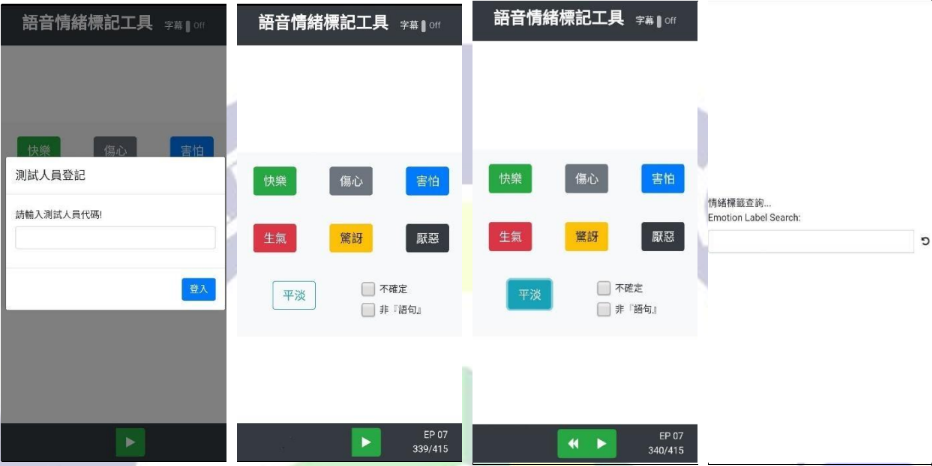

# Emotions_Utterance_AnnotationTool

A web tool for annotate utterance for emotion recognition

### Feature
- [x] base php server
- [x] users recorder
- [x] web RWD
- [x] support annoate audio
- [x] support annoate text
- [ ] back end gui



### How to use

1. Import database
>DataStruct.sql

- marker

| MarkerID | Recoders |
| ----- | ---- |
| a123  | ps*  |
| b123  | ps*  |
|.......|......|

>ps* 
"Status" can be "text" or "audio"
```json
{"Data"}:[
{"Status":"text","Remarks":"","EpisodeID","1","Scope":[{"Sentiment":"1","SentenceID":"A1"},{"Sentiment":"0","SentenceID":"A2"},
{"Sentiment":"5","SentenceID":"A3"}],
{"Status":"audio","Remarks":"","EpisodeID","2","Scope":[{"Sentiment":"3","SentenceID":"B1"},{"Sentiment":"6","SentenceID":"B2"},
{"Sentiment":"4","SentenceID":"B3"}],
{"Status":"text","Remarks":"","EpisodeID","3","Scope":[{"Sentiment":"2","SentenceID":"C1"},{"Sentiment":"1","SentenceID":"C2"},
{"Sentiment":"3","SentenceID":"C3"}]
```

- information

| VedioID | Num | EpisodeID |
| -- |---| - |
| A  | 100 | 1 |
| B  | 50  | 2 |
|... |...|...|

- comprehensive_form

| Sample | SentenceID | Sentiment | MarkerID | MarkTime | Status | Remark |
| - | -- | ---- | ----| ----- | ------ | -|
| 1 | A1 | 7   | a123| 21:39:20 | audio | 0 |
| 2 | C1 | 5   | b123| 21:50:10 | text | 2 |
| ... | ... | ...   | ...| ...| ... | ... |

- emotion_label
>Determine emotion

| id | word | emotion |
| -- |---| - |
| 1  | 氣死我了 | 生氣 |
| 2 | 不是這樣說的吧 | 厭惡 |
|... |...|...|

- sentence

| Id | SentenceID |Sentence | SpeakerGender | SentenceTime | ShowID | EpisodeID | DialogID | Sentiment |
| -- | ---- |---- | ---- | ---- | ---- | ---- | ---- | ---- |
| 1 | A1 |Hi how are you | 0 | 2300 | A | A1 | null | null |
| 2 | A2 |Nice to meet you | 1 | 1500 | A | A1 | null | null |
| ... | ... |... | ... | ... | ... | ... | ... | ... |

2. Set config
>conndb.php
       $servername = ""; //ip
       $username = "";
       $password = "";
       $dbname = "";

### Reference
This tool function is reference  from
https://arxiv.org/abs/1802.08379
